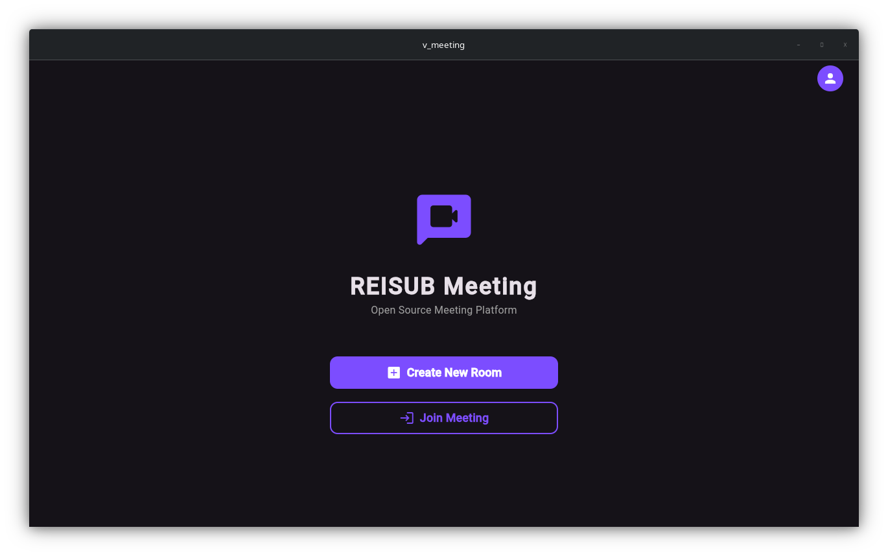
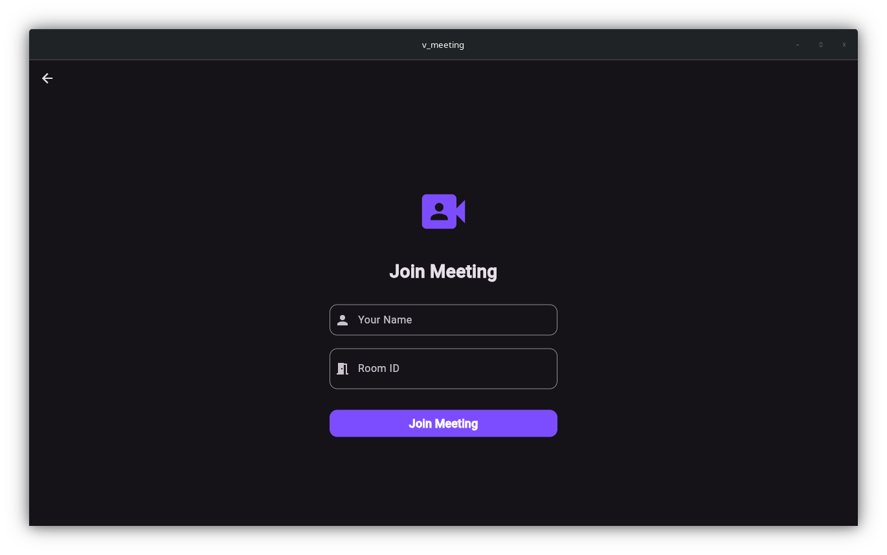
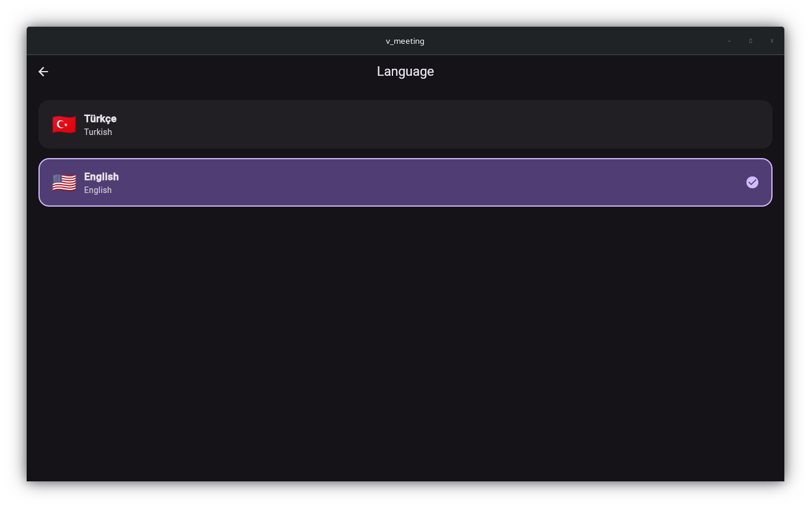
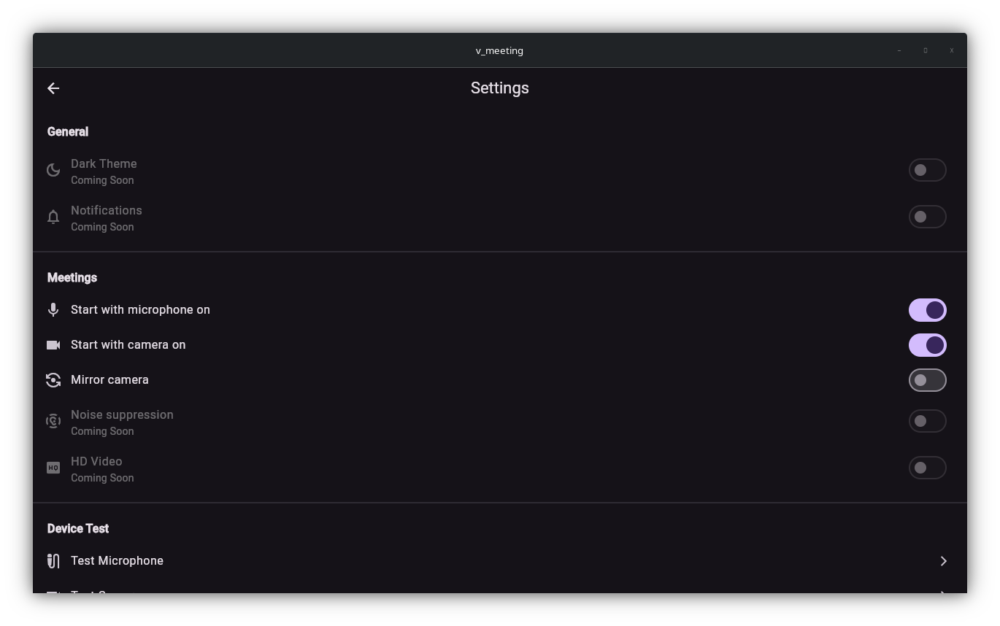
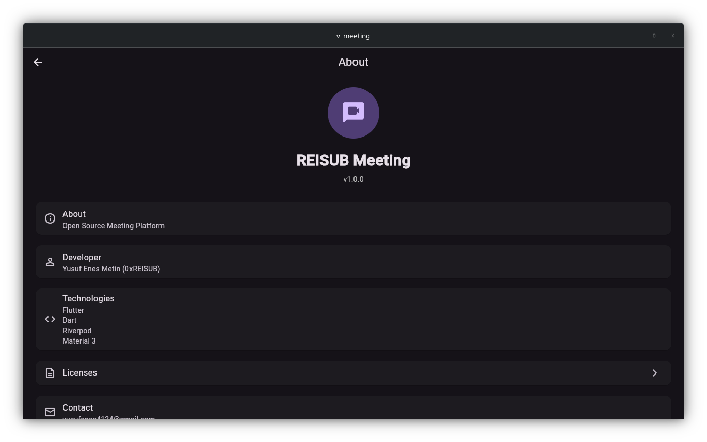

# REISUB Meeting

<p align="center">
  <strong>A modern, open-source video conferencing platform built with Flutter.</strong>
</p>

> 🚧 **Project Status:** REISUB Meeting is currently under active development. New features and improvements are being added regularly.

---

## ✨ Features (Planned)

- 📹 High-quality video conferencing
- 🎤 Crystal-clear voice communication
- 💬 In-meeting chat
- 🌍 Multi-language support
- 🎨 Modern Material 3 interface
- 🔒 Privacy-focused architecture
- 📱 Cross-platform support (Android, iOS, Windows, Linux, macOS)

---

## 📱 Screenshots

| Home | Join |
|------|------|
|  |  |

| Language | Settings |
|----------|----------|
|  |  |

| About |
|-------|
|  |

---

# REISUB Meeting

<p align="center">
  <strong>Flutter ile geliştirilmiş modern ve açık kaynaklı bir video konferans platformu.</strong>
</p>

> 🚧 **Proje Durumu:** REISUB Meeting şu anda aktif olarak geliştirilmektedir. Yeni özellikler ve iyileştirmeler düzenli olarak eklenmektedir.

---

## ✨ Planlanan Özellikler

- 📹 Yüksek kaliteli görüntülü görüşme
- 🎤 Net sesli iletişim
- 💬 Toplantı içi mesajlaşma
- 🌍 Çoklu dil desteği
- 🎨 Modern Material 3 arayüzü
- 🔒 Gizlilik odaklı mimari
- 📱 Android, iOS, Windows, Linux ve macOS desteği

---

## 📱 Ekran Görüntüleri

| Ana Sayfa | Toplantıya Katıl |
|-----------|------------------|
|  |  |

| Dil Seçimi | Ayarlar |
|------------|----------|
|  |  |

| Hakkında |
|-----------|
|  |

---

## 🚀 Getting Started

Clone the repository:

```bash
git clone https://github.com/REISUB/REISUB_Meeting.git
```

Go to the project directory:

```bash
cd REISUB_Meeting
```

Install dependencies:

```bash
flutter pub get
```

Run the application:

```bash
flutter run
```

---

## 🤝 Contributing

Contributions, issues, and feature requests are welcome.

Feel free to fork the repository and submit a Pull Request.

---

## 📄 License

This project is licensed under the **MIT License**.
See the **LICENSE** file for more information.
